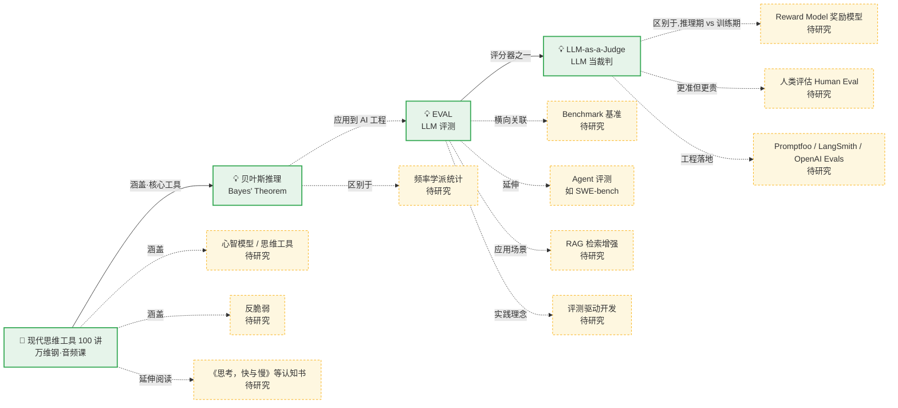

# 🕸️ 知识关系图谱（Relational Map）

> 这个文件记录所有研究过的主题，以及它们之间的关系。
> 每研究完一个新主题，我会：① 加一个节点；② 指明它和已有节点的关系（包含/基于/区别于/延伸出…）。
> **实线 = 已研究主题的实际关联；虚线 = 尚未研究、后续待展开的关联。**

> 说明：实线 = 已研究关联；虚线 = 待研究潜在关联。节点内容对应下方表格。

---

## 节点清单（已收录）

| 关键词 | 类型 | 一句话 | 文档 | 收录日期 |
|--------|------|--------|------|----------|
| EVAL | 💡 概念 | 给大模型应用写"测试"，衡量 AI 输出的好坏 | [concepts/EVAL.md](concepts/EVAL.md) | 2026-09-27 |
| LLM-as-a-Judge | 💡 概念 | 用更强的大模型按评分标准给 AI 输出打分 | [concepts/LLM-as-Judge.md](concepts/LLM-as-Judge.md) | 2026-09-27 |
| 现代思维工具 100 讲 | 📖 书籍 | 万维钢音频课程：思维工具的系统目录（非纸质书） | [books/现代思维工具100讲.md](books/现代思维工具100讲.md) | 2026-09-27 |
| 贝叶斯推理 | 💡 概念 | 先验 × 证据 → 后验，信念按比例更新的方法论 | [concepts/贝叶斯推理.md](concepts/贝叶斯推理.md) | 2026-09-27 |

## 关系清单（边）

| 来源 | 关系 | 目标 | 说明 |
|------|------|------|------|
| EVAL | 包含 **评分器** → | LLM-as-Judge | 最重要评分器（已收录） |
| LLM-as-Judge | **区别于**（推理期 vs 训练期）→ | Reward Model | 训练期打分器（待展开） |
| LLM-as-Judge | **参照基准** → | 人类评估 | 人类是最准确基准（待展开） |
| EVAL | **区别于** → | Benchmark | 自建评测 vs 公开基准（待展开） |
| EVAL | **延伸应用** → | Agent 评测 | SWE-bench 等（待展开） |
| EVAL | **应用场景** → | RAG 评测 | faithfulness 等指标（待展开） |
| EVAL | **实践理念** → | 评测驱动开发 | 写用例→跑评测→迭代（待展开） |
| LLM-as-Judge | **工程落地** → | Promptfoo / LangSmith / OpenAI Evals | 三大框架内置（待展开） |
| 现代思维工具 100 讲 | **涵盖·核心工具** → | **贝叶斯推理** | 概率思维一讲的核心（已收录） |
| 现代思维工具 100 讲 | **涵盖** → | 心智模型 / 反脆弱等 | 课程工具目录（待展开） |
| 贝叶斯推理 | **区别于** → | 频率学派统计 | 先验 vs 长期频率（待展开） |
| 贝叶斯推理 | **应用到** → | LLM 评测（EVAL） | 概率视角的校准思想（浅关联，已标注） |

---

## 待研究队列（虚线节点，后续激活）

**AI 工程线：** Reward Model / 人类评估 / Benchmark / Agent 评测 / RAG 评测 / 评测驱动开发 / 评测工具对比 / 频率学派统计
**认知线（来自思维课）：** 心智模型清单 / 反脆弱 / 《思考，快与慢》/ 第一性原理（如提到）

---
*本文件在每次新增主题时自动维护。*