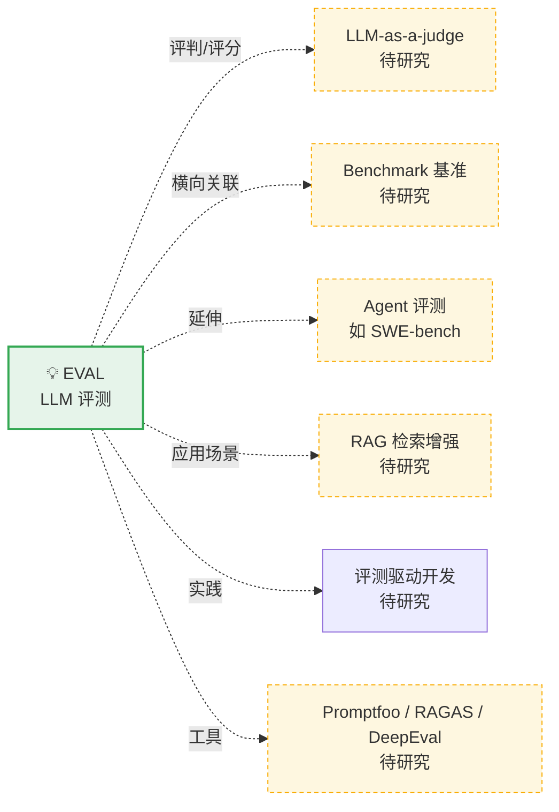

# 🕸️ 知识关系图谱（Relational Map）

> 这个文件记录所有研究过的主题，以及它们之间的关系。
> 每研究完一个新主题，我会：① 加一个节点；② 指明它和已有节点的关系（包含/基于/区别于/延伸出…）。
> **实线 = 已研究主题的实际关联；虚线 = 尚未研究、后续待展开的关联。**

---

## 节点清单（已录入）

| 关键词 | 类型 | 一句话 | 文档 | 收录日期 |
|--------|------|--------|------|----------|
| EVAL | 💡 概念 | 给大模型应用写"测试"，衡量 AI 输出的好坏 | [concepts/EVAL.md](concepts/EVAL.md) | 2026-09-27 |

## 关系清单（边）

| 来源 | 关系 | 目标 | 说明 |
|------|------|------|------|
| EVAL | 属于**核心方法论**的直接相关方 | LLM-as-Judge | EVAL 的评分器之一，也是最受争议的环节 |
| EVAL | **区别于** | Benchmark | 自建评测 vs 公开基准（第 4 节辨析） |
| EVAL | **延伸应用** | Agent 评测 | SWE-bench 等考察 Agent 能力，EVAL 是其工程化底座 |
| EVAL | **主要实现手段**的 | RAG 评测指标 | faithfulness、context precision/recall 是专用指标 |
| EVAL | **实践理念** | 评测驱动开发 | 把"写用例→跑评测→迭代"作为开发主循环 |
| EVAL | **工具生态** | Promptfoo / RAGAS / DeepEval 等 | 落地框架，构成开发者的日常工具箱 |

---

## 待研究队列（出现在虚线里的概念）

> 后续研究完成后，会把"待研究"移入节点清单、虚线虚线变实线。

- **LLM-as-Judge** — 大模型当裁判的细节、偏差与改进
- **Benchmark（基准）** — MMLU / HELM / BIG-bench 及其局限
- **Agent 评测** — SWE-bench、AgentBench 等
- **RAG（检索增强生成）** — 与评测指标天然绑定
- **评测驱动开发（EDD）** — 理念与落地步骤
- **评测工具** 对比：Promptfoo vs DeepEval vs RAGAS vs LangSmith

---
*本文件由每次新增主题时自动维护。*