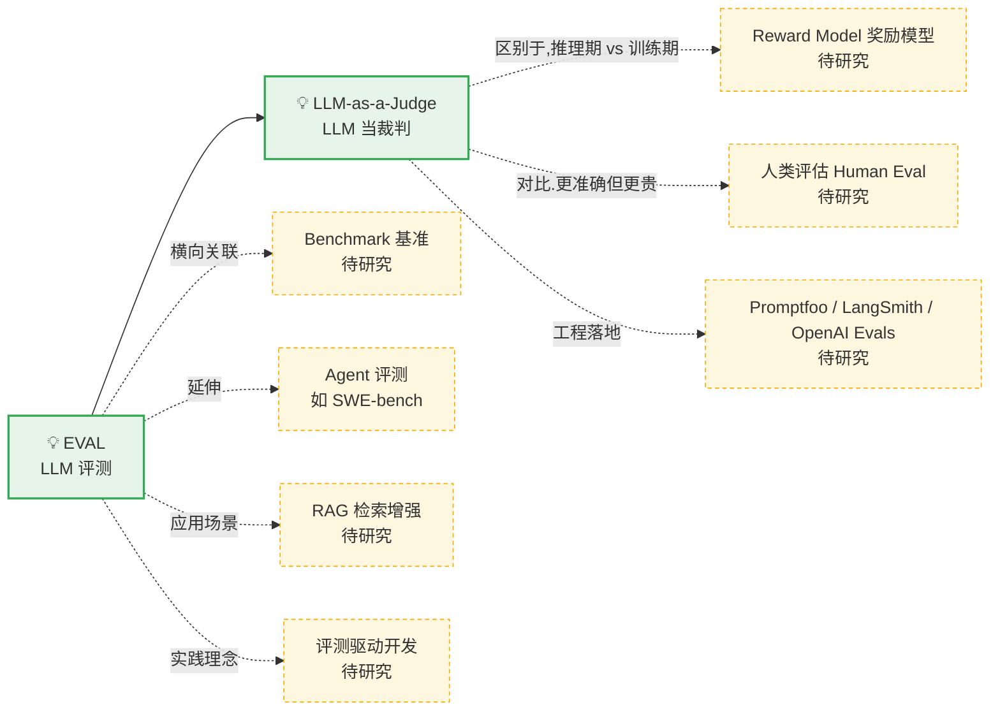

# 🕸️ 知识关系图谱（Relational Map）

> 这个文件记录所有研究过的主题，以及它们之间的关系。
> 每研究完一个新主题，我会：① 加一个节点；② 指明它和已有节点的关系（包含/基于/区别于/延伸出…）。
> **实线 = 已研究主题的实际关联；虚线 = 尚未研究、后续待展开的关联。**

> 说明：实线 = 已研究的关联；虚线 = 待研究的潜在关联。图中节点内容对应下方表格。

---

## 节点清单（已收录）

| 关键词 | 类型 | 一句话 | 文档 | 收录日期 |
|--------|------|--------|------|----------|
| EVAL | 💡 概念 | 给大模型应用写"测试"，衡量 AI 输出的好坏 | [concepts/EVAL.md](concepts/EVAL.md) | 2026-09-27 |
| LLM-as-a-Judge | 💡 概念 | 用更强的大模型按评分标准给 AI 输出打分 | [concepts/LLM-as-Judge.md](concepts/LLM-as-Judge.md) | 2026-09-27 |

## 关系清单（边）

| 来源 | 关系 | 目标 | 说明 |
|------|------|------|------|
| EVAL | 包含 **评分器** → | LLM-as-Judge | 主观打分的评分器，也是最有争议的一环（偏差、校准） |
| LLM-as-Judge | **区别于**（推理期 vs 训练期）→ | Reward Model | judge 在推理期打分，RM 在训练期学习打分（待展开） |
| LLM-as-Judge | **基准参照** → | 人类评估 | 人类是最准确基准，judge 是廉价替代品（待展开） |
| LLM-as-Judge | **工程落地** → | Promptfoo / LangSmith / OpenAI Evals | 三大框架内置 judge 能力（待展开） |
| EVAL | **区别于** → | Benchmark | 自建评测 vs 公开基准（待展开） |
| EVAL | **延伸应用** → | Agent 评测 | SWE-bench 等，EVAL 是其工程底座（待展开） |
| EVAL | **应用场景** → | RAG 评测 | faithfulness、context precision/recall（待展开） |
| EVAL | **实践理念** → | 评测驱动开发 | 写用例→跑评测→迭代 的开发主循环（待展开） |

---

## 待研究队列（虚线节点，后续激活）

- **Reward Model（奖励模型）** — RL 训练打分器，与 judge 互补
- **人类评估（Human Evaluation）** — 最可靠的基准
- **Benchmark（基准）** — MMLU / HELM / BIG-bench 及其局限
- **Agent 评测** — SWE-bench、AgentBench 等
- **RAG（检索增强生成）** — 与评测指标天然绑定
- **评测驱动开发（EDD）** — 理念与落地步骤
- **评测工具生态** — Promptfoo vs DeepEval vs RAGAS vs LangSmith

---
*本文件在每次新增主题时自动维护。*